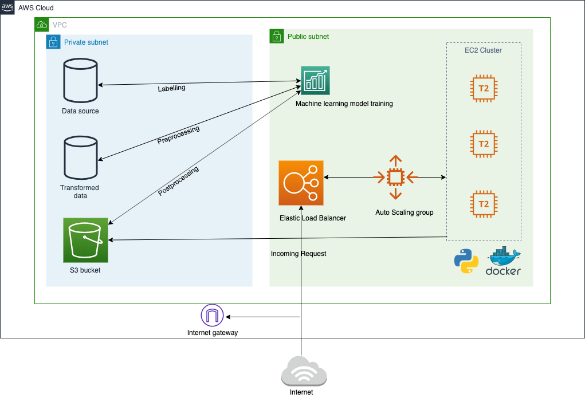

# WhomToVote

Team Members:
1. Prachal Jitendrakumar Patel
2. Priyam Vaidya
3. Jay Pathak
4. Ashwini Ulhas Talele

**WhomToVote?**

Description: By using the dataset of Indian election, a system can analyze voting patterns, change in the economy, poverty, GDP growth rate, and various other parameters to determine the performance of the previously elected government.

Goal: This system can help citizens to determine which was the most effective government in previous years based on data and facts. This will avoid data abuse for electoral purpose.

<h3>Abstract: </h3>
For any country, the government holds an important role for comprehensive development which is expected by the citizens. In order to decide which government to vote for, thorough knowledge is required. But, due to data abuse and digital frauds, people are convinced to vote for a particular candidate which might be misleading. Media and other resources might portray the details which forms biased government. The factors that one should take into consideration to select a government are economic growth, literacy rate etc. The aim is to gather data from previous elections, analyze economic growth patterns and represent in a visual format which can be easily understood by the voters. 

<h3>Architecture Diagram</h3>

**Technology stack: 
 Datasets: Kaggle, Election Commision of India
 Language: Python, Javascript
 Infrastructure: Docker, AWS DynamoDB, S3, EC2, ELB, ASG, Route53
 Visualisation: D3.js
Domain: Machine Learning**

